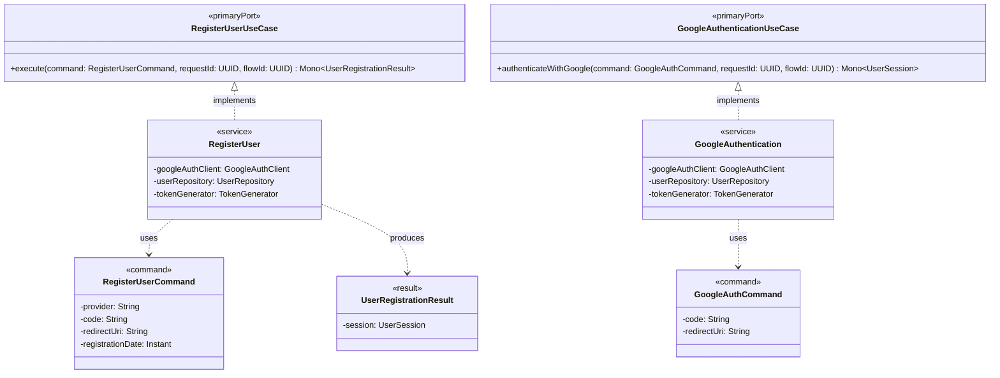
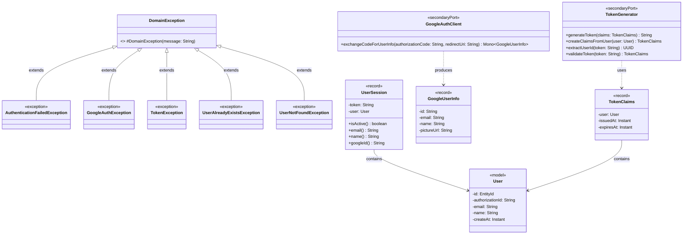

# Architecture

myvanitys-api uses hexagonal (ports and adapters) architecture with two bounded contexts and one shared package:

- `auth` — Google OAuth, JWT issuance/validation, user registration.
- `product` — catalog, collections, reviews.
- `common` — shared base exceptions, `GlobalExceptionHandler`, cross-cutting config, and the shared-kernel value object `EntityId`.

Dependencies point inward: adapters depend on application, application depends on domain. The domain depends on nothing framework-specific.

## Package layout (as it actually is)

```
com.myvanitys.api
├── auth
│   ├── domain            model, exception, port.secondary
│   ├── application       port.primary (+ command, result), service
│   └── infrastructure    adapter.primary, adapter.secondary, security, config, persistence
├── product
│   ├── domain            model, valueobject, exception, port.secondary, service
│   ├── application       port.primary, usecase, command, query, mapper
│   └── infrastructure    adapter.primary, adapter.secondary, persistence, config, exception
└── common                base exceptions, GlobalExceptionHandler, config, valueobject
```

Known inconsistency (tolerated, not enforced by any rule):

| Concept | auth | product |
|---|---|---|
| Use case implementations | `application.service` | `application.usecase` |
| Commands | `application.port.primary.command` | `application.command` |

`EntityId` is shared by both contexts and lives in `common.valueobject`, not in `product.domain`.

## Boundaries enforced by ArchUnit

`src/test/java/com/myvanitys/api/ArchitectureTest.java` enforces 7 rules. All are active and green; a violation is a regression to fix, not a rule to relax.

| Rule | Meaning |
|---|---|
| `domain_does_not_depend_on_infrastructure` | domain imports no adapter/persistence/security classes |
| `domain_does_not_depend_on_application` | domain imports no use cases/services |
| `primary_adapters_do_not_depend_on_secondary_adapters` | inbound adapters do not call outbound adapters |
| `controllers_only_in_primary_adapter` | `*Controller` classes live only in `infrastructure.adapter.primary` |
| `repository_adapters_only_in_secondary_adapter` | `*RepositoryAdapter` classes live only in `infrastructure.adapter.secondary` |
| `domain_does_not_depend_on_spring` | domain has no Spring imports |
| `application_does_not_depend_on_persistence` | application goes through ports, not `infrastructure.persistence` |

OpenAPI-generated classes (`com.myvanitys.api.rest.v1.*`, from `myvanitys-api-spec`) are excluded. They use the delegate pattern: hand-written `AuthController`/`ProductController` implement the generated `*ApiDelegate` interfaces, and the generated `*ApiController` remains the HTTP entry point.

## Auth context

Purpose: authenticate users through Google OAuth and issue/validate JWTs.

### JWT lifecycle

1. `TokenService` (application-facing security service) delegates to the `TokenGenerator` port.
2. `JwtTokenGeneratorAdapter` implements `TokenGenerator` and is the real signer/verifier:
   - `createClaimsFromUser(User)` builds `TokenClaims`.
   - `generateToken(TokenClaims)` signs a token with the HMAC key from `JwtProperties` (via `SecurityConfig.jwtSigningKey`).
   - `validateToken(String)` and `extractUserId(String)` verify signature/expiry; failures raise `TokenException`.
   - Claim mapping is done by `JwtClaimsAdapter` (`toJwtClaims` / `fromJwtClaims`); JWT JSON is serialized by jjwt-jackson.
3. `JwtAuthenticationFilter` (a `OncePerRequestFilter`, not Spring Security) validates the `Authorization` header via `TokenService`, stores the resolved user id in the request-scoped `AuthenticatedUserContext`, and short-circuits with a 401 `ProblemDetail` on failure.

There is no Spring Security dependency; `SecurityConfig` only exposes the JWT signing `Key`.

### Registration and login

- `RegisterUser` (`RegisterUserUseCase`) and `GoogleAuthentication` (`GoogleAuthenticationUseCase`) are the application services. Both use `GoogleAuthClient` (`GoogleAuthClientAdapter`), `UserRepository` (a domain secondary port implemented by `UserRepositoryAdapter`), and `TokenGenerator`.
- Google HTTP calls use `WebClient` (`WebClientConfig`, `GoogleClientProperties` with prefix `google.oauth2`).

### Diagram — auth application



### Diagram — auth domain



### Diagram — auth infrastructure

```mermaid
classDiagram
    class AuthController { <<primaryAdapter>> }
    class AuthenticationMapper { <<mapper>> }
    class CreateUserMapper { <<mapper>> }
    class GoogleAuthClientAdapter { <<secondaryAdapter>> +exchangeCodeForUserInfo(code: String, redirectUri: String) Mono~GoogleUserInfo~ }
    class JwtTokenGeneratorAdapter { <<secondaryAdapter>> +generateToken(claims: TokenClaims) String }
    class UserRepositoryAdapter { <<secondaryAdapter>> +save(user: User) Mono~User~ +findByAuthorizationId(authorizationId: String) Mono~User~ }
    class GoogleAuthClient { <<secondaryPort>> }
    class TokenGenerator { <<secondaryPort>> }
    class UserRepository { <<secondaryPort>> +save(user: User) Mono~User~ +findByAuthorizationId(authorizationId: String) Mono~User~ }
    class JwtAuthenticationFilter { <<filter>> +doFilterInternal(request, response, filterChain) void }
    class TokenService { <<service>> +extractUserId(tokenHeader: String) UUID +isValidToken(tokenHeader: String) boolean }
    class JwtClaimsAdapter { <<security>> +toJwtClaims(claims: TokenClaims) Map +fromJwtClaims(jwtClaims: Map, issuedAt: Instant, expiresAt: Instant) TokenClaims }
    class AuthenticatedUserContext { <<requestScope>> +getUserId() UUID +setUserId(userId: UUID) void }
    class JwtProperties { -secret: String -expiration: long }
    class GoogleClientProperties { -clientId: String -clientSecret: String -redirectUri: String }
    class SecurityConfig { +jwtSigningKey(jwtProperties: JwtProperties) Key }
    class UserEntity { <<entity>> -userId: UUID -token: String -email: String -name: String }
    class JpaUserRepository { <<repository>> }
    AuthController ..> AuthenticationMapper : uses
    AuthController ..> CreateUserMapper : uses
    GoogleAuthClientAdapter ..|> GoogleAuthClient : implements
    JwtTokenGeneratorAdapter ..|> TokenGenerator : implements
    JwtTokenGeneratorAdapter ..> JwtClaimsAdapter : uses
    UserRepositoryAdapter ..|> UserRepository : implements
    UserRepositoryAdapter --> JpaUserRepository : uses
    TokenService --> TokenGenerator : uses
    JwtAuthenticationFilter --> TokenService : uses
    JwtAuthenticationFilter --> AuthenticatedUserContext : populates
```

## Product context

Purpose: manage the product catalog, user collections, and reviews.

### Catalog and collections

- `CreateProduct`, `AddProductToMyVanity`, `DeleteProductFromUserVanity`, `FindProductAll`, `FindProductByUser`, `FindProductByTerm` implement the primary ports in `application.port.primary`.
- `Product` is the aggregate root. `ProductUserRelation` links a user to a product; `ProductRepository`, `CategoryRepository`, `ProductUserRepository`, `ReviewRepository` are the domain secondary ports (implemented under `infrastructure.adapter.secondary`).

Product uses `application.usecase` for implementations and `application.command` for commands (auth uses `application.service` + `application.port.primary.command`).

```mermaid
classDiagram
    class AddProductToMyVanityUseCase { <<primaryPort>> +execute(command: AddProductToMyVanityCommand) Product }
    class AddReviewToProductUseCase { <<primaryPort>> +execute(command: AddReviewToProductCommand) Product }
    class CreateProductUseCase { <<primaryPort>> +execute(command: CreateProductCommand) Product }
    class DeleteProductFromUserVanityUseCase { <<primaryPort>> +execute(command: DeleteProductFromUserVanityCommand) void }
    class FindProductAllUseCase { <<primaryPort>> +query() List~Product~ }
    class FindProductByTermUseCase { <<primaryPort>> +query(term: String) List~Product~ }
    class FindProductUserUseCase { <<primaryPort>> +query(query: FindProductUserQuery) List~Product~ }

    class AddProductToMyVanityCommand { <<command>> -productId: UUID -userId: UUID }
    class AddReviewToProductCommand { <<command>> -userId: EntityId -productId: EntityId -reviewDetails: ReviewDetails }
    class CreateProductCommand { <<command>> -name: String -brand: String -categoryId: EntityId -colorHex: String -userId: EntityId }
    class DeleteProductFromUserVanityCommand { <<command>> -productId: UUID -userId: UUID }
    class FindProductUserQuery { <<query>> -userId: EntityId }

    class AddProductToMyVanity { <<service>> -productRepository: ProductRepository -productUserRepository: ProductUserRepository +execute(command: AddProductToMyVanityCommand) Product }
    class AddReviewToProduct { <<service>> -productRepository: ProductRepository +execute(command: AddReviewToProductCommand) Product }
    class CreateProduct { <<service>> -productRepository: ProductRepository -categoryRepository: CategoryRepository -productUserRepository: ProductUserRepository +execute(command: CreateProductCommand) Product }
    class DeleteProductFromUserVanity { <<service>> -productUserRepository: ProductUserRepository +execute(command: DeleteProductFromUserVanityCommand) void }
    class FindProductAll { <<service>> -productRepository: ProductRepository +query() List~Product~ }
    class FindProductByTerm { <<service>> -productRepository: ProductRepository +query(term: String) List~Product~ }
    class FindProductByUser { <<service>> -productRepository: ProductRepository +query(query: FindProductUserQuery) List~Product~ }

    AddProductToMyVanityUseCase <|.. AddProductToMyVanity : implements
    AddReviewToProductUseCase <|.. AddReviewToProduct : implements
    CreateProductUseCase <|.. CreateProduct : implements
    DeleteProductFromUserVanityUseCase <|.. DeleteProductFromUserVanity : implements
    FindProductAllUseCase <|.. FindProductAll : implements
    FindProductByTermUseCase <|.. FindProductByTerm : implements
    FindProductUserUseCase <|.. FindProductByUser : implements

    AddProductToMyVanity ..> AddProductToMyVanityCommand : uses
    AddReviewToProduct ..> AddReviewToProductCommand : uses
    CreateProduct ..> CreateProductCommand : uses
    DeleteProductFromUserVanity ..> DeleteProductFromUserVanityCommand : uses
    FindProductByUser ..> FindProductUserQuery : uses
```



Full diagram and notes: `doc/classDiagramProduct/classDiagramProductApplication.mermaid`.


### Reviews

- Reviews belong to a `ProductUserRelation` and are managed through the `Product` aggregate (`addReviewFromUser`, `updateReview`, `deleteReview`), with validation in `ReviewDetails`.
- `ProductReview` is a stateless domain service for cross-product calculations. It is wired as a bean by `ProductReviewConfig` (it has no Spring dependency).

### Diagrams — product

See `doc/classDiagramProduct/`:

- `classDiagramProductApplication.mermaid` (embedded above)
- `classDiagramProductDomain.mermaid`
- `classDiagramProductInfra.mermaid`

## Data model

Relational schema is owned by Flyway (`src/main/resources/db/migration`, V1-V5) and mirrored by `doc/MER.mermaid`. Integration tests run PostgreSQL 16 (Testcontainers 2.x or Zonky embedded); production runs `postgres-ssl:16`.
